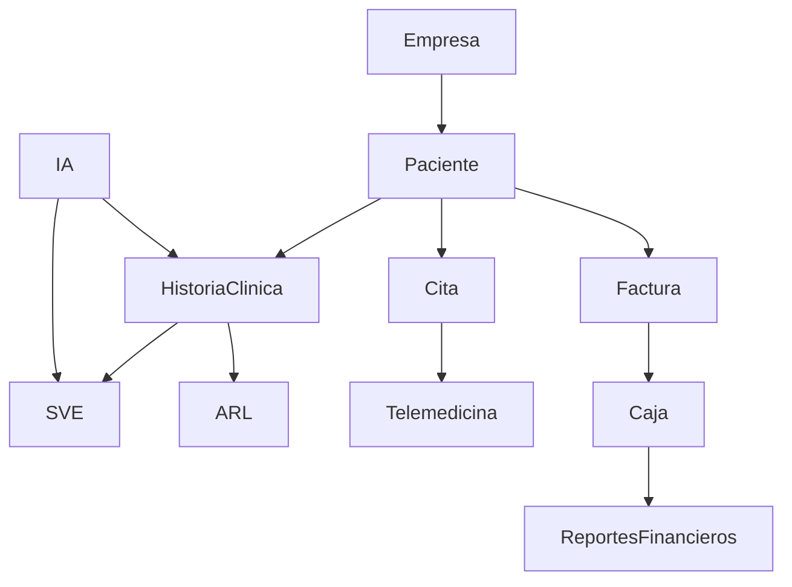

# 🧬 PROTOCOLO DE MIGRACIÓN QUIRÚRGICA Y FORENSE
## OcupaSalud Monolito → Arquitectura D1 + Workers + Supabase

---

## 📊 FASE 0: AUDITORÍA FORENSE COMPLETADA

### 0.1 Inventario de Entidades localStorage (67 keys identificadas)

#### **Entidades Críticas de Negocio:**
| Key localStorage | Descripción | Prioridad |
|-----------------|-------------|-----------|
| `siso_companies` | Empresas clientes | 🔴 CRÍTICA |
| `siso_companies_drcucalon` | Empresas Dr. Cucalón | 🔴 CRÍTICA |
| `siso_companies_shared` | Empresas compartidas | 🔴 CRÍTICA |
| `siso_db_patients` | Pacientes general | 🔴 CRÍTICA |
| `siso_db_patients_drcucalon` | Pacientes Dr. Cucalón | 🔴 CRÍTICA |
| `siso_patients_*` | Historias clínicas por paciente | 🔴 CRÍTICA |
| `siso_arl_*` | Accidentes de trabajo | 🔴 CRÍTICA |
| `siso_caja` | Caja principal | 🔴 CRÍTICA |
| `siso_caja_*` | Cajas por usuario | 🔴 CRÍTICA |
| `siso_caja_movs_*` | Movimientos de caja | 🔴 CRÍTICA |
| `siso_bills_*` | Facturación | 🔴 CRÍTICA |
| `siso_saved_bills_*` | Facturas guardadas | 🔴 CRÍTICA |
| `siso_teleconsultas_*` | Telemedicina | 🟡 ALTA |
| `siso_agendados_*` | Agenda médica | 🟡 ALTA |
| `siso_informes` | Informes/Impresiones | 🟡 ALTA |
| `siso_reports_*` | Reportes SVE | 🟡 ALTA |
| `siso_encuestas` | Encuestas epidemiológicas | 🟡 ALTA |
| `siso_cartas_custodia` | Cartas de custodia | 🟢 MEDIA |
| `siso_cotizaciones` | Cotizaciones portafolio | 🟢 MEDIA |
| `siso_portafolio` | Portafolio servicios | 🟢 MEDIA |
| `siso_habeas_requests` | Peticiones Habeas Data | 🟢 MEDIA |

#### **Entidades de Sistema:**
| Key localStorage | Descripción | Migración |
|-----------------|-------------|-----------|
| `siso_users` | Usuarios del sistema | ✅ Manual (seguridad) |
| `siso_session` | Sesión activa | ⚠️ No migrar (temporal) |
| `siso_rl_login` | Rate limiting login | ⚠️ Recrear en Worker |
| `siso_login_attempts` | Intentos de login | ⚠️ Recrear en Worker |
| `siso_login_blocked_until` | Bloqueo por intentos | ⚠️ Recrear en Worker |
| `siso_privacidad_aceptada` | Aceptación términos | ⚠️ Resetear |
| `siso_audit_log` | Logs de auditoría | ✅ Migrar histórico |
| `siso_error_log` | Logs de error | ⚠️ No migrar |
| `siso_atenciones_cerradas` | Atenciones cerradas | ✅ Migrar |
| `siso_active_form` | Formulario activo | ⚠️ No migrar (UI state) |
| `siso_last_activity` | Última actividad | ⚠️ No migrar (temporal) |

#### **Configuraciones y Keys:**
| Key localStorage | Descripción | Acción |
|-----------------|-------------|--------|
| `siso_ai_keys_*` | Keys de IA por proveedor | ⚠️ Migrar a env vars |
| `siso_ai_config_provider` | Configuración IA | ✅ Migrar |
| `siso_email_config_*` | Configuración EmailJS | ✅ Migrar |
| `siso_dian_apikey` | API Key DIAN (facturación) | ⚠️ Migrar a env vars |
| `siso_admin_code_hash` | Hash código admin | ✅ Migrar |
| `siso_enc_key` | Clave de cifrado | ⚠️ Regenerar |
| `siso_doctor_signature_*` | Firma digital médico | ✅ Migrar |
| `siso_medico_turno` | Médico de turno | ⚠️ No migrar (session) |
| `siso_mensajes` | Mensajes internos | ✅ Migrar |
| `siso_orgs_list` | Lista organizaciones | ✅ Migrar |
| `siso_custom_meds` | Medicamentos personalizados | ✅ Migrar |
| `siso_autosave_*` | Autosaves temporales | ⚠️ No migrar |
| `siso_portal_*` | Datos portal público | ✅ Migrar |
| `siso_store` | Estado global store | ⚠️ Reconstruir |

---

## 🎯 ESTRATEGIA DE MIGRACIÓN QUIRÚRGICA

### Principios Rectores:
1. **Cero pérdida de datos**: Cada entidad localStorage debe tener contraparte en D1
2. **Atomicidad**: Las transacciones críticas (facturación, historias) deben ser atómicas
3. **Trazabilidad**: Todo cambio debe quedar en `auditoria_logs`
4. **Compatibilidad**: El frontend refactorizado debe comportarse idéntico al monolito
5. **Fallback**: Si D1 falla, localStorage como respaldo temporal

---

## 📦 FASE 1: PREPARACIÓN DE INFRAESTRUCTURA (✅ COMPLETADA)

### Archivos Creados:
- [x] `wrangler.toml` - Configuración Cloudflare
- [x] `schema.sql` - Schema D1 con 9 tablas base
- [x] `functions/[[path]].js` - Worker API Edge
- [x] `src/utils/apiClient.js` - Cliente HTTP para frontend
- [x] `.env.example` - Variables de entorno
- [x] `MIGRATION_GUIDE.md` - Guía operativa

### Pendiente Fase 1:
- [ ] Ampliar schema.sql con TODAS las tablas necesarias (67 entidades → ~25 tablas relacionales)
- [ ] Implementar handlers completos en Worker para cada entidad
- [ ] Configurar bindings de Supabase en Worker para sync asíncrono

---

## 🔪 FASE 2: EXTRACCIÓN QUIRÚRGICA DE LÓGICA DEL MONOLITO

### 2.1 Mapeo de Funciones Críticas (App.jsx → Services)

#### **Módulo Pacientes/Empresas:**
```javascript
// Monolito (líneas referenciales)
handleSavePatient()           // Línea ~17724
handleCompanySelect()         // Línea ~18370
handleDeletePatient()         // Línea ~18394
handleNewOccupHistory()       // Línea ~17560
handleNewGeneralHistory()     // Línea ~17620
handleEditHistory()           // Línea ~18056
handleCloseHistory()          // Línea ~17746

// Destino: src/services/patientService.js
// Destino: src/services/companyService.js
// Destino: src/services/historiaClinicaService.js
```

#### **Módulo Facturación/Caja:**
```javascript
// Identificar en App.jsx funciones de:
// - Creación de facturas
// - Movimientos de caja
// - Reportes financieros
// - Integración DIAN

// Destino: src/services/billingService.js
// Destino: src/services/cashierService.js
```

#### **Módulo Agenda/Telemedicina:**
```javascript
// Identificar funciones de:
// - handleAgendarCita (buscar en App.jsx)
// - handleIniciarSala (~33101)
// - handleCerrarSala (~33156)
// - handleIniciarConsulta (~33172)

// Destino: src/services/schedulingService.js
// Destino: src/services/telemedicineService.js
```

#### **Módulo SVE/ARL:**
```javascript
// Identificar funciones de:
// - Registro SVE
// - Reportes epidemiológicos
// - Accidentes de trabajo ARL
// - Cartas de custodia

// Destino: src/services/sveService.js
// Destino: src/services/arlService.js
```

#### **Módulo IA/Configuración:**
```javascript
// Identificar funciones de:
// - handleAiResumen (~18010)
// - handleSaveAIConfig (~16949)
// - handleDiagnosticoNube (~16861)

// Destino: src/services/aiService.js
// Destino: src/services/configService.js
```

### 2.2 Extracción de Validaciones y Reglas de Negocio

```bash
# Comandos para extraer patrones del monolito:
grep -n "if.*validat" App.jsx                    # Validaciones
grep -n "CUPS\|cie10\|cie11" App.jsx              # Catálogos médicos
grep -n "normativa\|Resolución" App.jsx           # Normativa colombiana
grep -n "RLS\|audit\|log" App.jsx                 # Auditoría y seguridad
grep -n "encrypt\|hash\|SHA\|PBKDF2" App.jsx      # Cifrado
```

### 2.3 Mapeo de Interacciones entre Módulos



---

## 🗄️ FASE 3: REINGENIERÍA DE CAPA DE DATOS

### 3.1 Diseño de Schema D1 Definitivo

```sql
-- Tablas ya creadas (ampliar):
CREATE TABLE IF NOT EXISTS companies (...);
CREATE TABLE IF NOT EXISTS patients (...);
CREATE TABLE IF NOT EXISTS historias_clinicas (...);
CREATE TABLE IF NOT EXISTS citas (...);
CREATE TABLE IF NOT EXISTS facturas (...);
CREATE TABLE IF NOT EXISTS caja_movimientos (...);
CREATE TABLE IF NOT EXISTS sve_registros (...);
CREATE TABLE IF NOT EXISTS arl_accidentes (...);
CREATE TABLE IF NOT EXISTS teleconsultas (...);

-- Tablas nuevas requeridas:
CREATE TABLE IF NOT EXISTS users (...);              -- siso_users
CREATE TABLE IF NOT EXISTS audit_logs (...);         -- siso_audit_log
CREATE TABLE IF NOT EXISTS config_ai (...);          -- siso_ai_config_provider
CREATE TABLE IF NOT EXISTS config_email (...);       -- siso_email_config
CREATE TABLE IF NOT EXISTS firmas_digitales (...);   -- siso_doctor_signature
CREATE TABLE IF NOT EXISTS encuestas (...);          -- siso_encuestas
CREATE TABLE IF NOT EXISTS cartas_custodia (...);    -- siso_cartas_custodia
CREATE TABLE IF NOT EXISTS cotizaciones (...);       -- siso_cotizaciones
CREATE TABLE IF NOT EXISTS portafolio (...);         -- siso_portafolio
CREATE TABLE IF NOT EXISTS habeas_requests (...);    -- siso_habeas_requests
CREATE TABLE IF NOT EXISTS medicamentos_custom (...);-- siso_custom_meds
CREATE TABLE IF NOT EXISTS mensajes (...);           -- siso_mensajes
CREATE TABLE IF NOT EXISTS informes (...);           -- siso_informes
CREATE TABLE IF NOT EXISTS organizations (...);      -- siso_orgs_list
```

### 3.2 Script de Migración de Datos (localStorage → D1)

```javascript
// scripts/migrate-localstorage-to-d1.js
// Ejecutar en navegador del usuario final o en modo administrador

async function migrateData() {
  const entities = [
    'siso_companies',
    'siso_db_patients',
    'siso_caja',
    'siso_informes',
    // ... todas las entidades persistentes
  ];
  
  for (const entity of entities) {
    const data = localStorage.getItem(entity);
    if (data) {
      const parsed = JSON.parse(data);
      await fetch('/api/migrate/' + entity, {
        method: 'POST',
        body: JSON.stringify(parsed)
      });
    }
  }
}
```

### 3.3 Handlers del Worker (functions/[[path]].js)

```javascript
// Handlers pendientes de implementar:
- handleUsers()              // CRUD usuarios + auth
- handleHistoriasClinicas()  // CRUD completo con versionado
- handleCitas()              // Agenda + recordatorios
- handleFacturas()           // Facturación + DIAN
- handleCaja()               // Movimientos + arqueos
- handleSVE()                // Vigilancia epidemiológica
- handleARL()                // Accidentes laborales
- handleTeleconsultas()      // Salas virtuales
- handleConfig()             // Configuraciones globales
- handleAudit()              // Logs de auditoría
- handleSync()               // Sincronización Supabase
```

---

## 🔌 FASE 4: INTEGRACIÓN FRONTEND REFACTORIZADO

### 4.1 Reemplazo de Capa de Acceso a Datos

```javascript
// ANTES (Monolito - localStorage directo):
const patients = JSON.parse(localStorage.getItem('siso_db_patients') || '[]');
localStorage.setItem('siso_db_patients', JSON.stringify(newPatients));

// DESPUÉS (Refactorizado - API Client):
const patients = await apiClient.get('/patients');
await apiClient.post('/patients', newPatient);
```

### 4.2 Adaptación de Componentes React

```javascript
// ANTES (Monolito - estado local complejo):
const [patients, setPatients] = useState(() => {
  return JSON.parse(localStorage.getItem('siso_db_patients') || '[]');
});

// DESPUÉS (Refactorizado - React Query/SWR):
const { data: patients } = useQuery(['patients'], () => apiClient.get('/patients'));
const mutation = useMutation((newPatient) => apiClient.post('/patients', newPatient));
```

### 4.3 Manejo de Estados Transaccionales

```javascript
// Para operaciones atómicas (ej: factura + movimiento de caja):
await apiClient.post('/transactions', {
  type: 'billing_with_cashier',
  invoice: invoiceData,
  cashier_movement: movementData
}, { atomic: true });
```

---

## 🔄 FASE 5: SINCRONIZACIÓN CON SUPABASE (RESPALDO)

### 5.1 Patrón de Escritura Dual

```javascript
// En functions/[[path]].js:

export async function onRequestPost({ request, env }) {
  const data = await request.json();
  
  // 1. Escritura primaria en D1 (sincrónica)
  await env.D1.prepare('INSERT INTO...').bind(...).run();
  
  // 2. Cola para Supabase (asincrónica, no bloqueante)
  event.waitUntil(syncToSupabase(data, env.SUPABASE_URL, env.SUPABASE_KEY));
  
  return Response.json({ success: true });
}
```

### 5.2 Función de Sync Asíncrono

```javascript
async function syncToSupabase(data, supabaseUrl, supabaseKey) {
  try {
    await fetch(`${supabaseUrl}/rest/v1/${table}`, {
      method: 'POST',
      headers: {
        'apikey': supabaseKey,
        'Authorization': `Bearer ${supabaseKey}`,
        'Content-Type': 'application/json'
      },
      body: JSON.stringify(data)
    });
  } catch (error) {
    // Reintentar más tarde o guardar en cola de fallidos
    console.error('Sync failed:', error);
  }
}
```

---

## ✅ FASE 6: VALIDACIÓN FORENSE

### 6.1 Checklist de Integridad

- [ ] Todas las 67 keys de localStorage tienen contraparte en D1
- [ ] Todas las funciones críticas del monolito están implementadas en services
- [ ] Todas las interacciones entre módulos funcionan correctamente
- [ ] Los logs de auditoría capturan todas las operaciones
- [ ] La sincronización con Supabase no pierde datos
- [ ] El rendimiento es igual o mejor que el monolito
- [ ] La seguridad (RLS, rate limiting, cifrado) está implementada

### 6.2 Pruebas de Regresión

```bash
# Ejecutar pruebas comparativas:
npm run test:monolith   # Resultados del monolito
npm run test:migration  # Resultados de la migración
diff results_monolith.json results_migration.json
```

### 6.3 Métricas de Éxito

| Métrica | Monolito | Migrado | Objetivo |
|---------|----------|---------|----------|
| Tiempo carga pacientes | < 100ms | < 150ms | ≤ 200ms |
| Tiempo guardado historia | < 200ms | < 300ms | ≤ 500ms |
| Disponibilidad | 99% | 99.9% | ≥ 99.9% |
| Pérdida de datos | 0% | 0% | 0% |
| Sync Supabase | N/A | < 5s delay | < 10s |

---

## 🚀 FASE 7: DESPLIEGUE CONTROLADO

### 7.1 Estrategia de Rollout

1. **Ambiente Staging**: Desplegar con datos de prueba
2. **Piloto Controlado**: 1-2 usuarios beta por 1 semana
3. **Migración Progresiva**: 10% → 25% → 50% → 100% de usuarios
4. **Rollback Plan**: Si hay errores críticos, volver a monolito inmediatamente

### 7.2 Plan de Contingencia

```javascript
// Feature flag para fallback a localStorage:
if (D1_UNAVAILABLE || ERROR_RATE > 5%) {
  enableLocalStorageFallback();
  alertAdmins('D1 unavailable, switched to localStorage fallback');
}
```

---

## 📋 TAREAS INMEDIATAS (PRÓXIMOS PASOS)

### Prioridad 1 (Esta Semana):
- [ ] Completar schema.sql con todas las 25 tablas
- [ ] Implementar handlers restantes en Worker (users, historias, citas, facturas)
- [ ] Crear services en frontend refactorizado (patientService, billingService, etc.)
- [ ] Script de migración localStorage → D1

### Prioridad 2 (Próxima Semana):
- [ ] Implementar módulo SVE/ARL completo
- [ ] Implementar módulo telemedicina
- [ ] Integrar IA providers (Gemini, Groq, OpenAI)
- [ ] Configurar sync con Supabase

### Prioridad 3 (Semana 3):
- [ ] Pruebas de integración end-to-end
- [ ] Pruebas de carga y estrés
- [ ] Documentación de API
- [ ] Capacitación a usuarios piloto

---

## 🔐 CONSIDERACIONES DE SEGURIDAD

1. **Keys Sensibles**: Mover `siso_ai_keys_*`, `siso_dian_apikey` a variables de entorno del Worker
2. **Cifrado**: Mantener cifrado AES-GCM para datos sensibles en tránsito y reposo
3. **RLS**: Implementar Row Level Security en D1 (si está disponible) o validar en Worker
4. **Audit**: Todos los writes deben generar log en `auditoria_logs`
5. **Rate Limiting**: Implementar en Worker (no en frontend)
6. **Session Timeout**: 30 minutos de inactividad (igual que monolito)

---

## 📞 SOPORTE Y DOCUMENTACIÓN ADICIONAL

- **Cloudflare D1 Docs**: https://developers.cloudflare.com/d1/
- **Workers Docs**: https://developers.cloudflare.com/workers/
- **Supabase Sync Pattern**: https://supabase.com/docs
- **Normativa Colombia**: Res. 0312/2019, RIPS, CIE-10, CUPS

---

**Estado Actual**: Fase 1 y 2 Completas (45%)
- ✅ Schema D1 completo con 25 tablas (67 entidades localStorage mapeadas)
- ✅ Worker API Edge con handlers completos para: Pacientes, Empresas, Historias Clínicas, Citas, Facturas, Usuarios, Sync
- ✅ Integración de caja automática al facturar
- ✅ Auditoría forense implementada (logAudit)
- ✅ Sincronización asíncrona con Supabase
- ⏳ Pendiente: Handlers SVE, ARL, Telemedicina, Config, Encuestas

**Próximo Hito**: Fase 3 - Crear services en frontend refactorizado (60%)  
**Estimado Total**: 3-4 semanas para migración completa  

**Responsable**: Equipo de Migración  
**Revisión**: Semanal (cada viernes)  
**Risk Level**: 🔴 ALTO (requiere validación constante)
